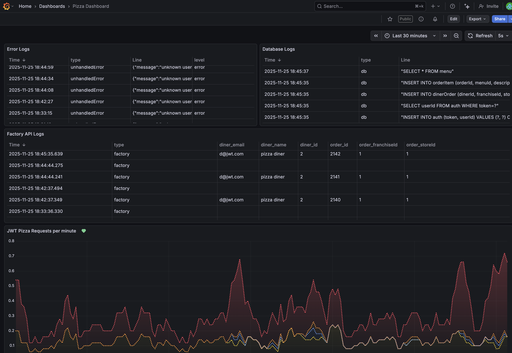

# Curiosity Report: Bash Scripting

Bash (Bourne Again SHell) is a widely used Unix shell and command language. It is the default shell on many Linux distributions, and bears similarities to other shells like sh, ksh, and zsh. Thus, it is a native part of many of the machines used in development and production environments, a type of computational "lingua franca".

This report will present some of my findings on **1)** why Bash scripting is meaningful in QA and DevOps, **2)** some of the most powerful use cases for Bash scripting in these fields, and **3)** an additional application of Bash scripting in the context of JWT-Pizza.

## Why does Bash Scripting Matter in QA and DevOps?

The name of the game in QA and DevOps is automation. The more that a task can be correctly automated and rely less on human intervention, the more stable and efficient the development and deployment pipelines become. Those automated tasks will become less prone to human error, and developers will have time, energy, and cognitive bandwidth freed up to focus on other tasks. 

So why is Bash scripting particularly important? Lots of tools that exist in the DevOps and QA space can automate things too, so why is Bash Scripting so important? 

One of the reasons is because of its ubiquity. Bash is installed by default on most Unix-like operating systems, including Linux and macOS. According to W3Techs, as of Nov 23, 2025, 90.3% of all websites with a known operating system run on Unix or Unix-like systems. Thus, Bash scripts can be natively run on the overwhelming majority of servers and development environments

Another reason is that many automation tools used in CI/CD pipelines, such as GitHub Actions, *actually use Bash scripts under the hood* to execute commands. 

For example, here is one of the steps from the `build` job in the GitHub Actions workflow for JWT-Pizza:

```yaml
- name: set version
  id: set_version
  run: |
    version=$(date +'%Y%m%d.%H%M%S')
    echo "version=$version" >> "$GITHUB_OUTPUT"
    printf '{"version": "%s" }' "$version" > public/version.json
```
Additionally, of the 7 steps in the `build` job, 4 of them use the `run` keyword to execute Bash commands directly. Over half of the steps in this job are actually Bash scripting!

## Bash Scripting in the Real World: Use Cases

Here are some of the most common use cases for Bash scripting in QA and DevOps, with code examples:

1. **Automating Testing during CI/CD Pipelines**: This is one of the key usages in JWT-Pizza.

```bash
npx playwright install --with-deps chromium
npm run test:coverage
```

2. **Monitoring Server Health**: The commands `top`, `df -h`, and `free -m` can be used to monitor CPU, disk, and memory usage, respectively. These results can be logged using file redirection.

```bash
echo top -b -n1 > server_health.log
echo df -h > server_health.log
echo free -m > server_health.log
```
3. **Automating Backups**: Bash scripts can be used to create backups of important files or databases.

```bash
#!/bin/bash
backup_dir="/backup/$(date +%Y%m%d)"
mkdir -p $backup_dir
cp -r /data/* $backup_dir
echo "Backup completed at $backup_dir"
```

4. **Copying build artifacts to deployment servers**: After building an application, Bash scripts can be used to copy the build artifacts to the appropriate servers. This is one of the steps in the `deploy` job in JWT-Pizza's GitHub Actions workflow.

```bash
echo Deploying $version
aws s3 cp dist s3://${{ secrets.APP_BUCKET }} --recursive
aws cloudfront create-invalidation --distribution-id ${{ secrets.DISTRIBUTION_ID }} --paths "/*"
```

## Additional Application: Traffic Generation using Cron Jobs

Something that caught my attention while doing research is cron jobs. Cron is a time-based job scheduler in Unix-like operating systems. Users can schedule jobs (commands or scripts) to run periodically at fixed times, dates, or intervals. This is particularly useful for automating repetitive tasks.

I wanted to find a way to use this to help with JWT-Pizza. One of the challenges that I found was remembering to generate traffic while working on my metrics and logging deliverables. When I needed to observe changes to my metrics code, I would often have to start the script and then wait a few minutes for meaningful data to be there.

So, I decided to learn how to set up a cron job that would run traffic generation every weekday at noon. This way, I could ensure that there would be a steady stream of traffic to JWT-Pizza without needing to remember to start the script manually. Following are the steps that I took:

1. Open the terminal.
2. Type `crontab -l` to list existing cron jobs (if any).
3. Type `crontab -e` to edit the cron jobs file.
4. Add the following line to schedule the traffic generation script to run every weekday at 3pm:

   `0 15 * * 1-5 /path/to/generatePizzaTraffic.sh https://pizza-service.jtdevops.click`
5. Save and exit the editor.

Now, here are some metrics visible from the cron job running later in the day:



### Other Considerations

Admittedly, this application has a fairly small scale, and is mostly for personal use. That does have value, but a way to make this more applicable and scalable would be to set up cron jobs on the production server itself. This way, traffic generation could be more consistent and not dependent on my personal machine being on and connected to the internet. That would also be the ideal setup for other applications described earlier, such as automated backups and server health monitoring.

### References
- [Usage statistics and market shares of operating systems for websites](https://w3techs.com/technologies/overview/operating_system)
- [.github/workflows/ci.yml](.github/workflows/ci.yml)
- [Mastering Bash Scripting for DevOps: Your Guide to Automation and Efficiency](https://mihirpopat.medium.com/mastering-bash-scripting-for-devops-your-guide-to-automation-and-efficiency-1f851f45f38c)